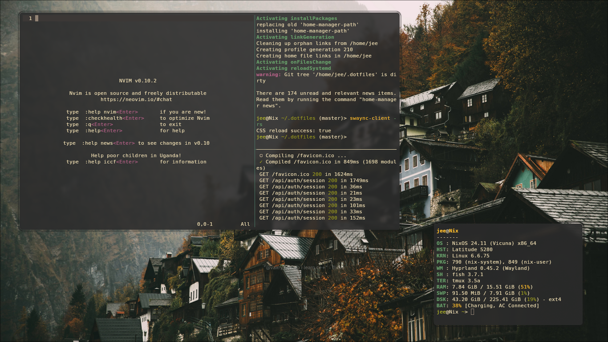
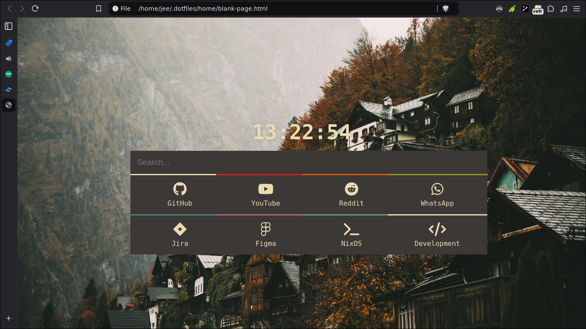
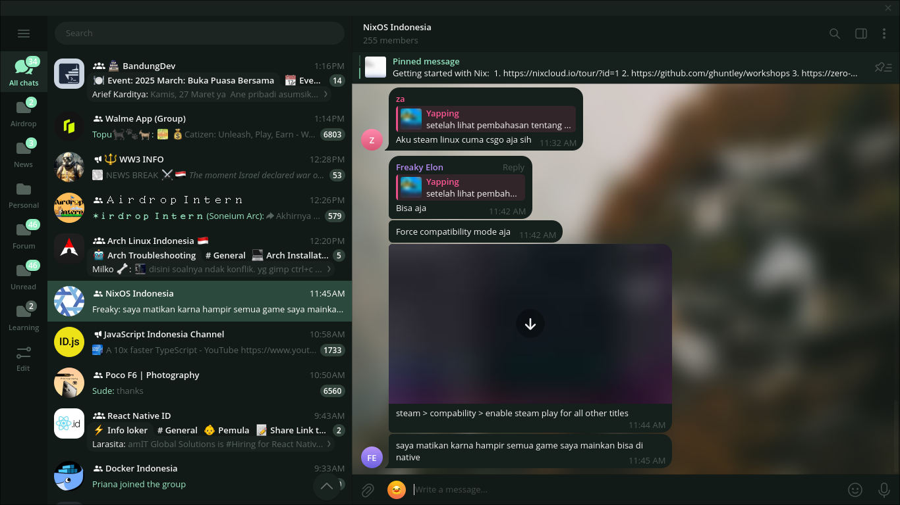
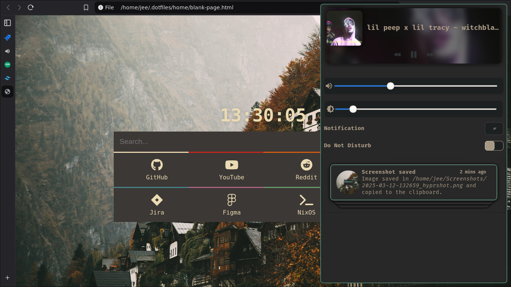

(DRY) - Don't repeat yourself is a principle in software development. We should use this principle to reduce repetitive and time-consuming work. Personally, I just try to apply this principle in my professional and personal work. The most basic example is making these dotfiles, so that I don't have to provide the needs of the devices or tools used in everyday life. So, from this motivation you can see the main goal (Goal).

## Preview

## Instalation
### Nixos Build
`sudo nixos-rebuild switch --flake .#username`
ex: `sudo nixos-rebuild switch --flake .#jee`  

### Home Build
`home-manager switch --flake .#username`
ex: `home-manager switch --flake .#jee`  
